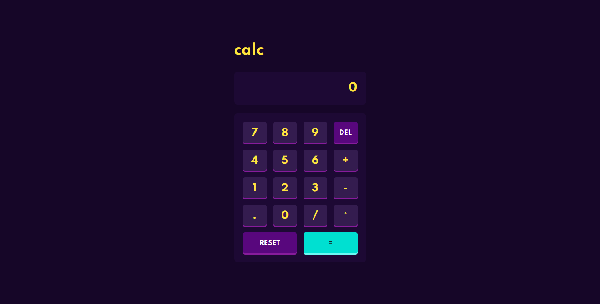

# Calc

Uma simples calculadora feita utilizando HTML, CSS e JavaScript. 

## Table of contents

- [Sobre a Atividade](#sobre-a-atividade)
- [Screenshot](#screenshot)
- [Links](#links)
- [Feito Com](#feito-com)
- [O que Aprendi](#o-que-aprendi)

## Sobre a Atividade

Usuários devem ser capazes de:

- Calcular corretamente as contas matemáticas

## Screenshot

> 

## Links

- Live Site URL: [Site](https://daviidsantos.github.io/calc/)

## Feito Com

- JavaScript
- HTML 5 Semântico
- CSS 3
- Flexbox
- Grid

## O que Aprendi

Aprendi a utilizar os eventos no Javascript
